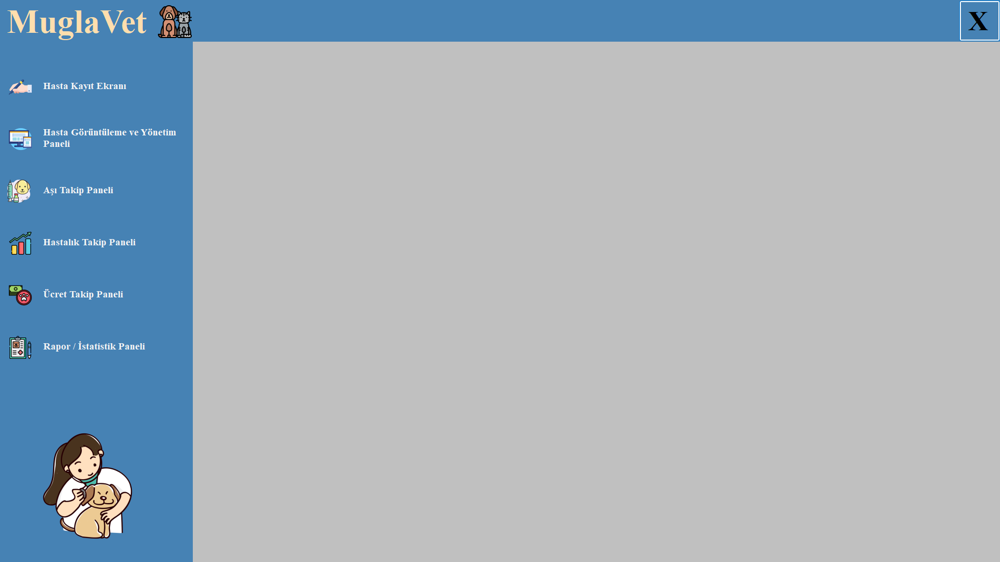
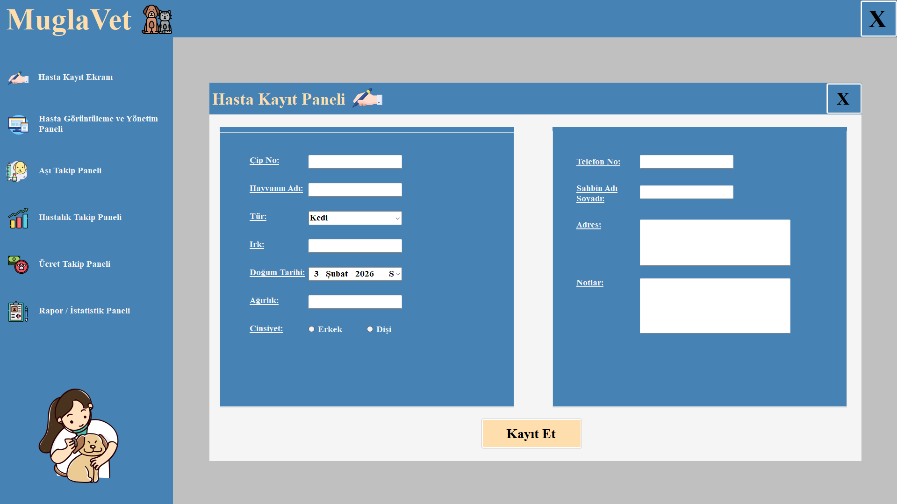
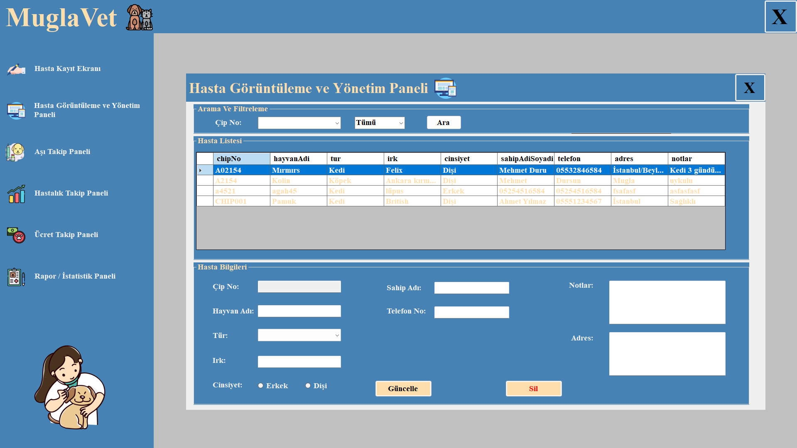
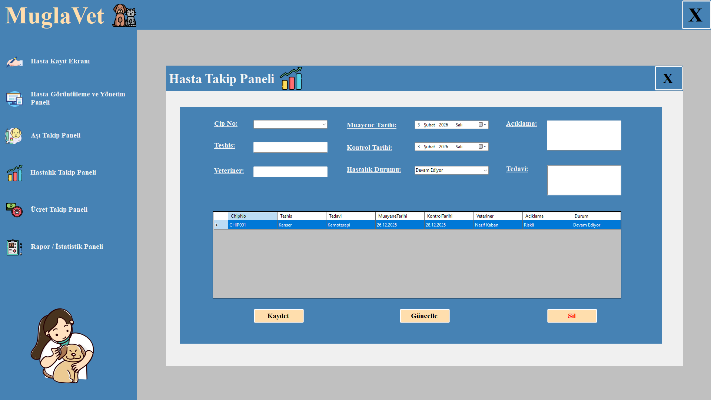

# 🐾 MuglaVet – Veteriner Klinik Yönetim Sistemi

**Geliştirici:** Ömer Faruk Sarıkaya  
**Teknoloji:** C# (.NET WinForms), Microsoft SQL Server  
**Proje Türü:** Masaüstü Uygulaması  
**Amaç:** Kurumsal Klinik Otomasyonu  
**Durum:** Geliştirme Tamamlandı

---

## 🎯 Projenin Amacı

**MuglaVet**, bir veteriner kliniğinde gerçekleştirilen tüm operasyonel süreçleri tek bir sistem altında toplamak amacıyla geliştirilmiş kapsamlı bir **Veteriner Klinik Yönetim Sistemi**dir.

Bu proje ile amaçlanan:
- Hasta kayıtlarının düzenli ve güvenli şekilde tutulması
- Klinik personelinin iş yükünün azaltılması
- Tedavi, ücretlendirme ve raporlama süreçlerinin dijitalleştirilmesi
- Gerçek hayattaki klinik işleyişine uygun bir otomasyon mimarisi kurulmasıdır

Proje, **nesne yönelimli programlama (OOP)** prensipleri temel alınarak geliştirilmiştir.

---

## 🧱 Yazılım Mimarisi

Uygulama **katmanlı ve modüler mimari** yaklaşımı ile tasarlanmıştır.

### Kullanılan Temel Yaklaşımlar:
- Nesne Yönelimli Programlama (OOP)
- Katmanlı Mimari
- Form bazlı kullanıcı arayüzü (WinForms)
- Veritabanı destekli kalıcı veri yönetimi

---

## 🛠️ Kullanılan Teknolojiler

| Teknoloji | Açıklama |
|---------|---------|
| **C#** | Ana programlama dili |
| **.NET WinForms** | Masaüstü arayüz geliştirme |
| **Microsoft SQL Server** | Veritabanı yönetimi |
| **ADO.NET** | SQL Server bağlantısı |
| **Visual Studio** | Geliştirme ortamı |

---

## 🗄️ Veritabanı Yapısı (SQL Server)

Projede **Microsoft SQL Server** kullanılmıştır.

### Temel tablolar:
- **Hastalar**
- **Sahipler**
- **Tedaviler**
- **Aşı Kayıtları**
- **Ücretlendirme**
- **Raporlar**

Veri işlemleri:
- Güvenli bağlantı
- CRUD işlemleri
- Formlar üzerinden dinamik veri güncelleme

---

## 🧩 Uygulama Modülleri

### 🔐 Giriş Sistemi
- Kullanıcı doğrulama
- Yetkilendirilmiş erişim
- Klinik personeli için güvenli giriş

📸 **Giriş Ekranı**


🎥 **Demo Video:**  
[girisekrani.mp4](girisekrani.mp4)

---

### 🏠 Ana Ekran
- Tüm modüllere hızlı erişim
- Kullanıcı dostu sade arayüz

📸  


---

### 🐶 Hasta Kayıt Modülü
- Yeni hasta ekleme
- Hasta bilgilerini güncelleme
- Hayvan türü, yaşı, sahibi vb. bilgiler

📸  


---

### 📋 Hasta Görüntüleme & Takip
- Kayıtlı hastaların listelenmesi
- Geçmiş tedavi bilgilerinin görüntülenmesi
- Düzenli takip imkanı

📸  


📸  


---

### 💉 Aşı Takip Sistemi
- Yapılan aşıların kaydı
- Aşı tarihleri ve takibi
- Klinik düzeninin sağlanması

📸  


---

### 💰 Ücret Takip Modülü
- Yapılan işlemlerin ücretlendirilmesi
- Ödeme kayıtları
- Klinik gelir takibi

📸  


---

### 📊 Rapor & İstatistik Modülü
- Klinik faaliyet raporları
- Hasta yoğunluğu
- Gelir istatistikleri

📸  


---

## ▶️ Uygulamayı Çalıştırma

1. Bu repoyu klonlayın:
   ```bash
   git clone https://github.com/omersarikayaa/MuglaVet.git
   evcilHayvanSaglikTakibi.sln dosyasını Visual Studio ile açın.
   SQL Server üzerinde veritabanını oluşturun ve bağlantı ayarlarını kontrol edin.
   Projeyi Start ederek çalıştırın.
